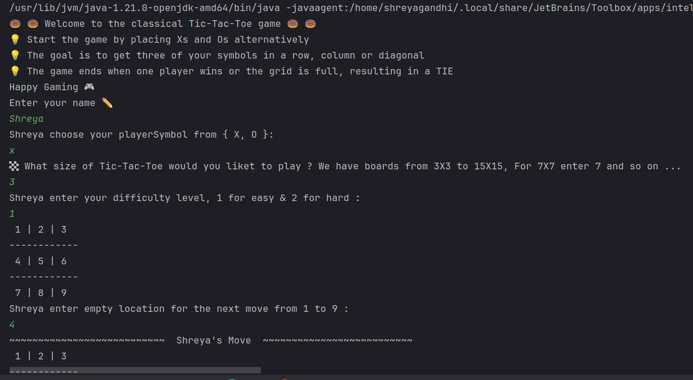
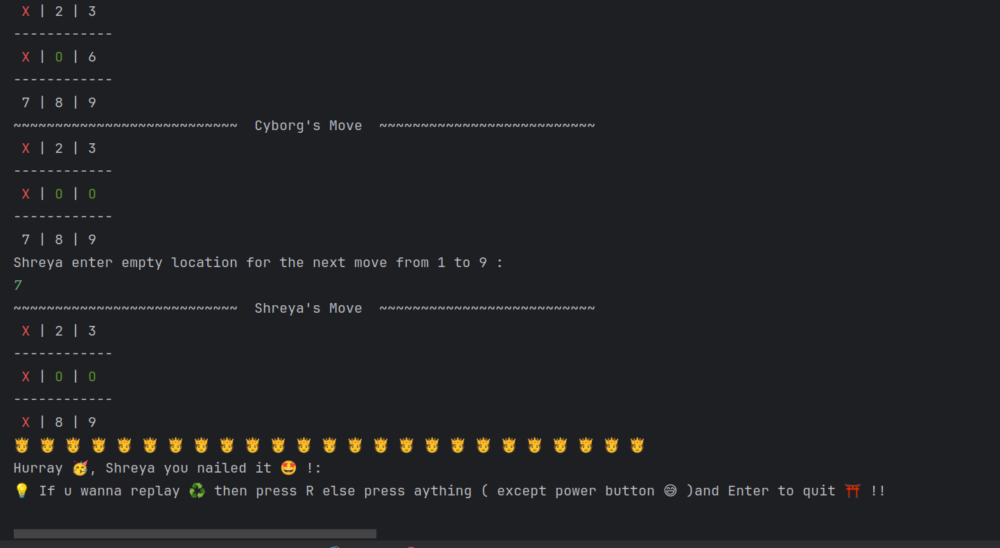

# Tic-Tac-Toe Game

## Overview

This is a simple command-line Tic-Tac-Toe game where a human player can challenge the computer (Cyborg) in a classic NxN grid battle. The game has been implemented in Java and is designed to demonstrate basic object-oriented programming principles, including Strategy design pattern.

## Features

- **Randomized Computer Moves:** The computer's moves are randomized for unpredictability.
- **Interactive UI:** Command-line interface with clear prompts and board display.
- **Winning Detection:** The game automatically detects and announces the winner or a tie.
- **Input Validation:** User input is validated to ensure only valid moves are made.

### Example Gameplay

## Installation

### Prerequisites

- Java Development Kit (JDK) 21 or higher
- An IDE like IntelliJ IDEA, Eclipse, or any text editor
- A terminal/command prompt for running the game

### Steps

1. **Clone the Repository**
  
2. **Navigate to the Project Directory**
 
3. **Compile the Java Files**
  
4. **Run the Game**
  

## Usage

1. Run the game.
2. Enter your name when prompted.
3. Choose your symbol (X or O).
4. Enter the board size between 3X3 to 15X15.
5. Choose the difficulty level from easy or hard.
6. The game will display the board and ask you to choose a position (1-9).
7. The computer (Cyborg) will then make its move.
8. The game continues until there is a winner or a tie.

## Classes

- **`Main`:** Entry point of the game, manages user interaction and game flow.
- **`Game`:** Controls the flow of the game, switching between player and computer moves, and checking for the end of the game.
- **`Board`:** Represents the Tic-Tac-Toe board and manages moves, display, and checking for a winner or a tie.
- **`Player`:** Base(Parent) class for players, with `HumanPlayer` and `Cyborg` as its subclasses.
- **`Strategy`:** Base Interface used for the selection of game dificulty with EasyStrategy and HardStrategy as its subclasses.
- **`OutOFPosition`**, **`OutOfRange`**, **`EvenNumber`** are the user-defined exception classes.
## Future Enhancements

- Implement a more advanced graphical user interface (GUI) that includes a menu and allows for keyboard input.
- Implement AI to play more intelligently rather than relying on random moves.
- Develop a Ultimate (Super) Tic-Tac-Toe game, which consists of 9 individual Tic-Tac-Toe games. 

## Contributing

Contributions are welcome! Please open an issue or submit a pull request on GitHub.
